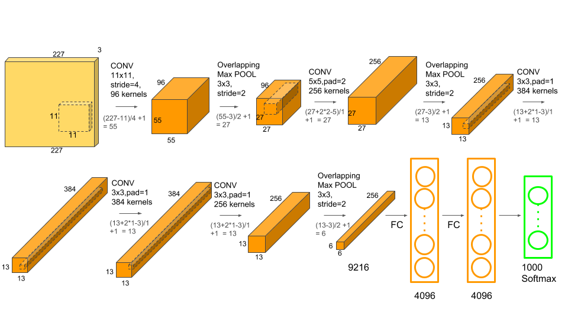

# ECE 695 CUDA Programming Part 4 (Bonus)

## Professor Tim Rogers   TA: Abhishek Bhaumick

## Due on May 8, 2021

# Introduction

The directions for this part are simple: take the computations kernels you
created in the first 3 labs and use them to create AlexNet from them.
To remind you, the architecture of AlexNet[[1]] is as follows.
\
    

Try to optimize the full AlexNet flow as much as possible - validating it on the
CPU will be very difficult given how long it will take on the CPU. So simply
measure the full AlexNet execution time at different batch sizes and report.

Completing this will give you serious street credit, you can now claim you
implemented AlexNet from scratch using CUDA :)

# Discussion

There are 3 kernel functions, for convolutional layer, maxpool layer and fully connected layer, with names convLayer_gpu, poolLayer_gpu and gemmLayer_gpu respectively. All the kernel implementations include using shared memory for optimizing the kernel execution and use unmanaged memory (using cudamalloc and cudamemcpy). The results show that the API call cudaMemcpy covers a significant part of the execution time, other than the convolutional kernel. Fully connected and maxpool occupy negligible time compared to others, also because they are called less number of times and not compute-intensive. Note that in general the execution time increases with batch size. For the batch size of 2, there is a slight decrease, possibly due to more data reuse resulting in lower data movements and latency. 

# References

<a id="1">[1]</a>
Alex Krizhevsky, Ilya Sutskever, and Geoffrey E. Hinton. 2012. ImageNet classification with deep con-volutional neural networks. In Proceedings of the 25th International Conference on Neural Information Processing Systems - Volume 1 (NIPS’12). Curran Associates Inc., Red Hook, NY, USA, 1097–1105.
